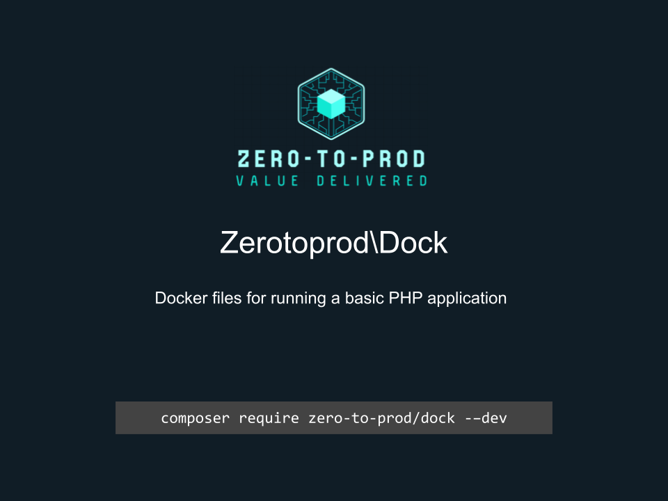

# Zerotoprod\Dock



[](https://github.com/zero-to-prod/dock)
[](https://packagist.org/packages/zero-to-prod/dock/stats)
[](https://packagist.org/packages/zero-to-prod/dock)
[](https://github.com/zero-to-prod/dock)
[](https://github.com/zero-to-prod/dock/blob/main/LICENSE.md)
[](https://hitsofcode.com/github/zero-to-prod/dock/view?branch=main)

## Introduction

Dock provides a Docker powered local development experience for a PHP application.
Other than Docker, no software or libraries are required to be installed on your local computer before using Dock.
Dock's simple CLI means you can start building your PHP application without any previous Docker experience.

## TLDR

Supports PHP versions: `7.1` - `8.4`.

```shell
dock install # Forwards arguments to the install service
dock <arguments> # Forwards arguments to the php service
dock test # Forwards arguments to a pre-configured test command
dock composer # Forwards arguments to the composer service
```

## Installation

To install this package run composer install:

```shell
composer require zero-to-prod/dock --dev
```

## Usage

Add these values to your `.env` file:

```dotenv
PHP_VERSION=8.4
PHP_DEBUG=8.4
PHP_COMPOSER=8.4
PHPUNIT_DIR=tests/config
```

Set up your `docker-compose.yml` like this:

```yaml
services:
  php:
    volumes:
      - ./:/app:delegated
      - ./.docker/vendor-cache/php${PHP_VERSION:-8.4}:/app/vendor
      - ./tests/config/${PHP_VERSION:-8.4}/phpunit.xml:/app/phpunit.xml
    build:
      context: ./vendor/zero-to-prod/dock/runtimes/${PHP_VERSION:-8.4}
      target: base
    env_file:
      - .env

  debug:
    volumes:
      - ./:/app:delegated
      - ./.docker/vendor-cache/php${PHP_DEBUG:-8.4}:/app/vendor
      - ./tests/config/${PHP_VERSION:-8.4}/phpunit.xml:/app/phpunit.xml
      - ./vendor/zero-to-prod/dock/runtimes/${PHP_DEBUG:-8.4}/conf:/usr/local/etc/php
    build:
      context: ./vendor/zero-to-prod/dock/runtimes/${PHP_DEBUG:-8.4}
      target: debug
    env_file:
      - .env

  composer:
    volumes:
      - ./:/app:delegated
      - ./.docker/vendor-cache/php${PHP_COMPOSER:-8.4}:/app/vendor
    build:
      context: ./vendor/zero-to-prod/dock/runtimes/${PHP_COMPOSER:-8.4}
      target: composer
    env_file:
      - .env
```